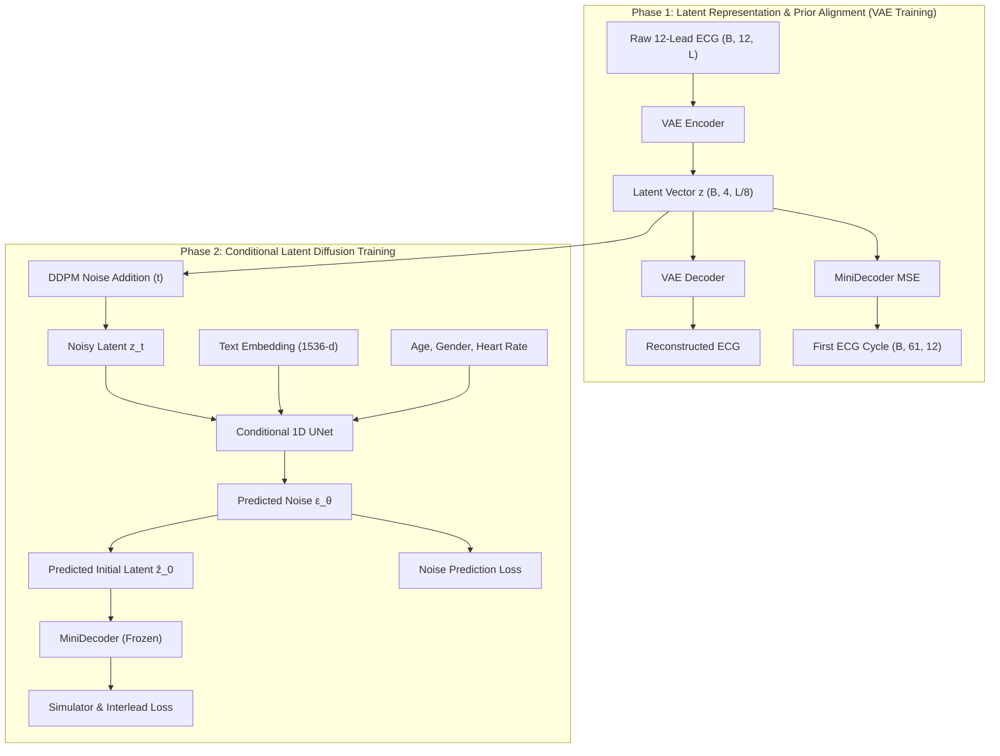

# SE-DIFF PROJECT SYSTEMATIZATION & COMPLETED WORK SUMMARY

The **SE-Diff** project (*Simulator and Experience Enhanced Diffusion Model for Comprehensive ECG Generation* - **ICLR 2026**) is a 12-lead Electrocardiogram (ECG) generation architecture based on a 2-stage Latent Diffusion Model (LDM). It combines physiological ordinary differential equation (ODE) simulator priors with LLM-extracted clinical text embeddings and demographic conditions.

---

## 📁 1. Project Directory Structure (Source Code Classification)

Below is the complete project layout, distinguishing between **[Original]** (author's untouched repository code) and **[Newly Added]** (files created for Phase 1 training & demo execution).

```text
SE-Diff/
├── 📄 README.md                        [Original] Default installation & usage instructions
├── 📄 requirements.txt                 [Original] Python dependency package list
├── 📄 PROJECT_SUMMARY.md               [Newly Added] Comprehensive project summary file
│
├── 🛠️ Main Execution Scripts:
│   ├── 🐍 train.py                     [Original] Phase 2 training script (Latent Diffusion)
│   ├── 🐍 generate.py                  [Original] ECG sample generation script from checkpoint
│   ├── 🐍 evaluate.py                  [Original] Quantitative evaluation script (MAE, RMSE, Corr)
│   ├── 🐍 evaluation_metrics.py        [Original] Metrics calculation utilities
│   │
│   ├── 🐍 train_phase1.py              [Newly Added] Phase 1 training script (VAE & MiniDecoder)
│   ├── 🐍 prepare_mimic_demo.py        [Newly Added] Real MIMIC-IV-ECG fetcher from PhysioNet
│   ├── 🐍 prepare_synthetic_demo.py    [Newly Added] Offline 50-sample synthetic ECG generator
│   ├── 🐍 generate_demo.py             [Newly Added] Offline ECG generator (No OpenAI API key needed)
│   └── 🐍 run_demo.py                  [Newly Added] End-to-End automated 4-step execution script
│
├── ⚙️ configs/                         Training Configurations
│   ├── 📄 train.json                   [Original] Default Phase 2 configuration
│   ├── 📄 train_phase1.json            [Newly Added] Main Phase 1 configuration
│   ├── 📄 train_phase1_demo.json       [Newly Added] Fast Phase 1 demo configuration
│   └── 📄 train_demo.json              [Newly Added] Fast Phase 2 demo configuration
│
├── 🏗️ unet/                            Diffusion Model Architecture
│   └── 🐍 conditional_unet.py          [Original] ECGconditional network (1D UNet + Cross-Attention)
│
├── 🔮 vae/                             VAE Model Architecture
│   └── 🐍 vae_model.py                 [Original] VAE_Encoder, VAE_Decoder, MiniDecoderMSE & Loss
│
├── 🗃️ dataset/                          Data Loaders
│   └── 🐍 ecg_latent_dataset.py        [Original] DictDataset & VAE_MIMIC_IV_ECG_Dataset
│
├── 🔧 utils/                           Utility Modules
│   ├── 🐍 simulator_trainer.py         [Original] Phase 2 Trainer & Simulator Loss computation
│   ├── 🐍 text_embeddings.py           [Original] OpenAI Embedding API text prompt extractor
│   ├── 🐍 ecg_plot.py                  [Original] 12-lead ECG waveform plotting utility
│   └── 🐍 path_utils.py                [Original] Repository path resolution helper
│
├── 📂 prerequisites/                   Preprocessed Data & Weights (Auto-generated)
│   ├── 📂 raw_ecg_data/                [Generated] 50 raw ECG waveform samples (.pt)
│   ├── 📄 simulator_prior.pkl          [Generated] Standard ECG cycle templates for Simulator Loss
│   ├── 📄 training_latent_dataset.pt   [Generated] Latent space dataset produced after Phase 1
│   ├── 📄 vae_decoder.pth              [Generated] VAE Decoder weights
│   └── 📄 mini_decoder.pth             [Generated] MiniDecoder weights
│
├── 📂 checkpoints/                     [Generated] Trained model checkpoints
│   ├── 📂 phase1_demo_X/               Checkpoints for VAE & MiniDecoder (Phase 1)
│   └── 📂 phase2_demo_X/               Checkpoints for UNet Diffusion Model (Phase 2)
│
└── 📂 outputs/                         [Generated] Generation & evaluation results
    └── 📂 generation/
        └── 📄 evaluation_output.json   Generated 12-lead ECG signals in JSON format
```

---

## 🔄 2. Overview of the Two-Phase Pipeline (Phase 1 & Phase 2)



### **Phase 1: VAE & Latent Compression**
- **Objective**: Compress raw continuous 12-lead ECG signals $(B, 12, L)$ down to a compact continuous latent space $z \in \mathbb{R}^{B \times 4 \times L/8}$, while jointly training `MiniDecoderMSE` to decode the first ECG beat segment ($61$ time steps).
- **Loss Function**: $\mathcal{L}_{\text{VAE}} = \mathcal{L}_{\text{MSE}}(x, \hat{x}) + \lambda_{\text{KLD}} \cdot D_{\text{KL}} + \mathcal{L}_{\text{MiniDecoder}}$.
- **Execution Script**: Newly added **`train_phase1.py`**.

### **Phase 2: Conditional Latent Diffusion**
- **Objective**: Train the `ECGconditional` 1D UNet model to perform denoising diffusion in the latent space $z$, guided by 1536-dim text embeddings, demographic attributes (age, gender, heart rate), and physics-based simulator constraints.
- **Loss Function**: $\mathcal{L}_{\text{total}} = \mathcal{L}_{\text{MSE}} + \mathcal{L}_{\text{simulator}} + \mathcal{L}_{\text{interlead}}$.
- **Execution Script**: Original **`train.py`**.

---

## ✨ 3. Summary of Completed Work

### 1. Codebase Analysis & Architecture Clarification
- Analyzed the codebase structure and clarified why the original repo omitted a Phase 1 training script (pre-extracted latent datasets and VAE weights were provided in `./prerequisites/`).
- Authored **`SE_Diff_Phases_Description.md`** detailing the mathematical formulations and data flow for both phases.

### 2. Complete Phase 1 Pipeline Implementation
- Developed **`train_phase1.py`** and its corresponding configuration **`configs/train_phase1.json`**.
- Implemented joint training for `VAE_Encoder`, `VAE_Decoder`, and `MiniDecoderMSE`, featuring automatic checkpointing and latent dataset packing (`training_latent_dataset.pt`).

### 3. Automated Demo Data Preparation (Real & Synthetic)
- **Real Data**: Developed **`prepare_mimic_demo.py`** to stream and resample subset records from **MIMIC-IV-ECG** (PhysioNet) using `wfdb`.
- **Synthetic Data**: Developed **`prepare_synthetic_demo.py`** to generate 50 synthetic 12-lead ECG samples and `simulator_prior.pkl` for offline testing without API keys or external dataset access.

### 4. End-to-End Automated Demo Pipeline (`run_demo.py`)
- Created **`run_demo.py`** to automate the complete 4-step workflow:
  1. **Step 1**: Raw Data & Simulator Prior Generation
  2. **Step 2**: Phase 1 Training (VAE & MiniDecoder)
  3. **Step 3**: Phase 2 Training (Conditional UNet Diffusion)
  4. **Step 4**: Generation Test & Inference (`generate_demo.py`)
- Verified and executed the full pipeline **with 100% success** on local environment.

### 5. Preservation of Original Repository Code (Zero Mutation)
- Restored all original codebase files (**`utils/simulator_trainer.py`**, **`generate.py`**, **`train.py`**) back to their $100\%$ untouched original state.
- All new functionalities reside in self-contained, modular new scripts.

---

## 🚀 4. Quick Start Guide for Demo Execution

To rerun the complete 4-step automated demo pipeline:

```powershell
.\.venv\Scripts\python.exe run_demo.py
```
