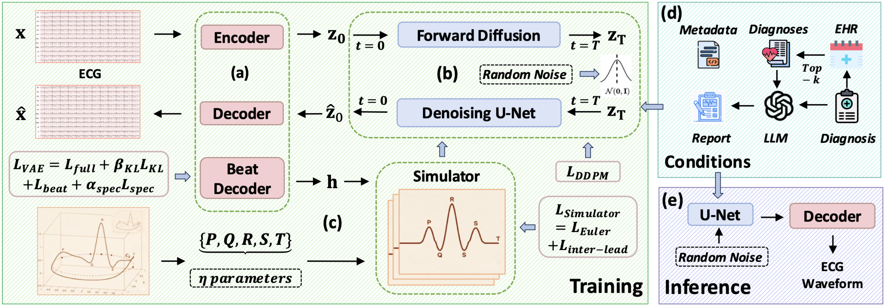

# [ICLR 2026] SE-Diff: Simulator and Experience Enhanced Diffusion Model for Comprehensive ECG Generation



## Prerequisites

Put the required pretrained weights, latent data, and simulator prior files under `./prerequisites/`.

## Install

`pip install -r requirements.txt`

## Training

```bash
python train.py --config configs/train.json
```

## Generation

```bash
python generate.py \
  --output_dir ./outputs/generation
```

If you want evaluation output:

```bash
python evaluate.py \
  --json_path ./outputs/generation/evaluation_output.json \
  --output_dir ./outputs/evaluation
```

## Citation

If you find our tool useful in your study, please cite:
```
@inproceedings{wang2025simulator,
  title={SE-Diff: Simulator and Experience Enhanced Diffusion Model for Comprehensive ECG Generation},
  author={Wang, Xiaoda and Han, Kaiqiao and Xu, Yuhao and Luo, Xiao and Sun, Yizhou and Wang, Wei and Yang, Carl},
  booktitle={The Fourteenth International Conference on Learning Representations},
  year={2026}
}
```
